# tamaclawtchi

A Tamagotchi-style desk pet for the **M5Stack Cardputer-Adv**, starring **Clawd**, the orange
block-character crab from the Claude Code logo. Clawd lives on the 240 × 135 screen and follows
your day: he sleeps at night, drinks coffee, cycles to work, works at a computer, eats lunch, works
out, watches TV and reads before bed. He also wanders off into side activities on his own (bike
rides, volleyball, yoga, dancing, music). Real weather shows in his window, and he wears hats on
holidays. You can feed him, pet him, change what he's doing and jump to any time of day.

The device was a giveaway at Anthropic's *Code with Claude* conference. This repo turns it into a
dedicated Clawd machine: it boots straight into Clawd, with no menu.

Everything here was built in one long Claude Code session. The **Learnings** section records every
hardware and firmware surprise found along the way; read it before changing anything.

## Screenshots

| | |
|---|---|
| 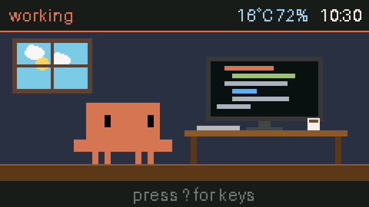 **10:30, working**: types while code scrolls | 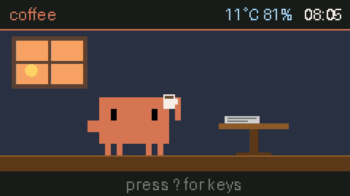 **08:05, coffee**: sunrise in the window |
| 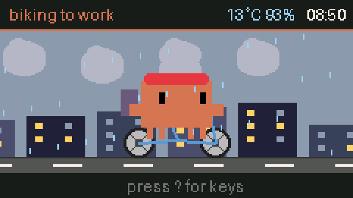 **08:50, biking to work**: in the rain | 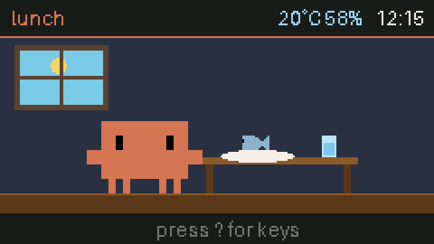 **12:15, lunch**: a fish, bite by bite |
| 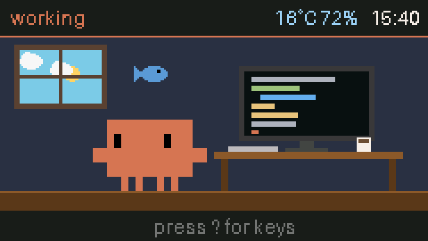 **Feeding**: press any letter and a fish drops in | 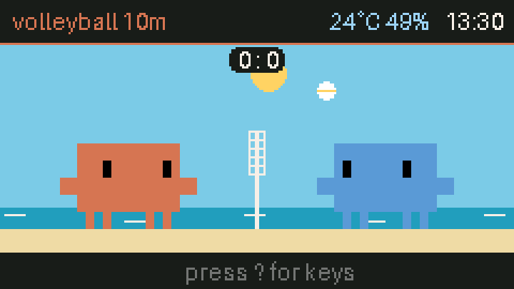 **Volleyball**: a side activity against a blue crab |
| 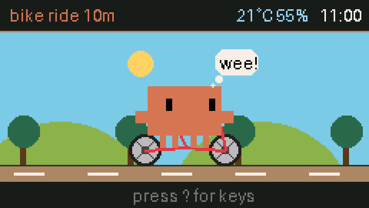 **Bike ride**: through the countryside | 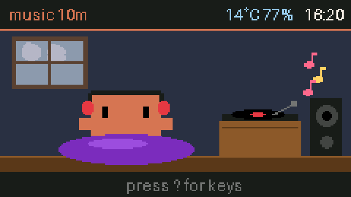 **Music**: headphones, bean bag, record player |
| 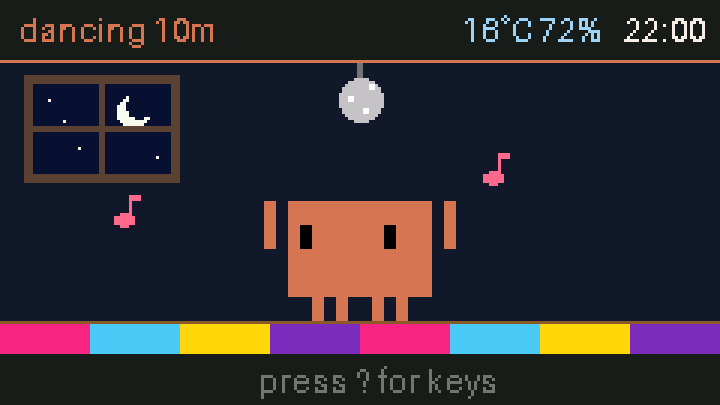 **Dancing**: under a disco ball | 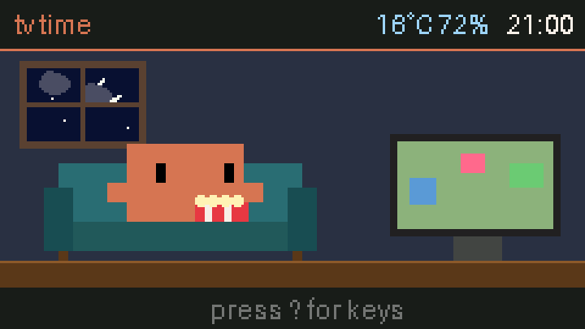 **21:00, TV time**: with popcorn |
| 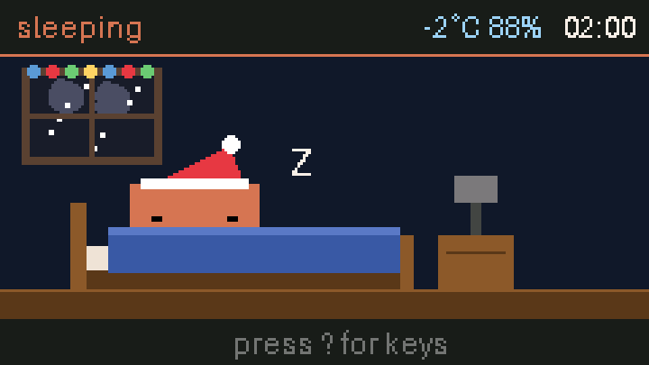 **02:00 on Christmas**: snow, fairy lights, Santa hat | 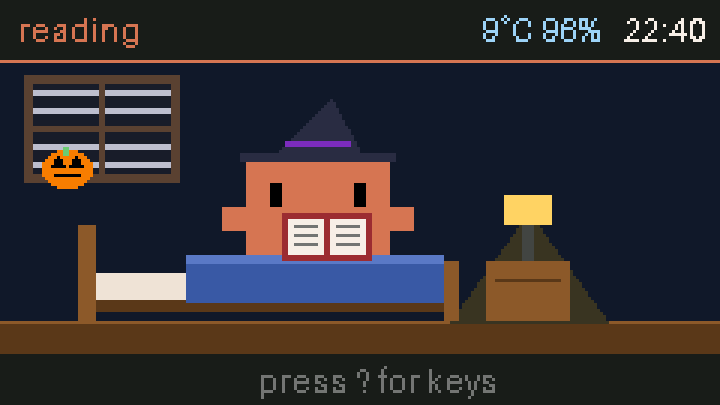 **22:40 on Halloween**: fog, pumpkin, witch's hat |
| 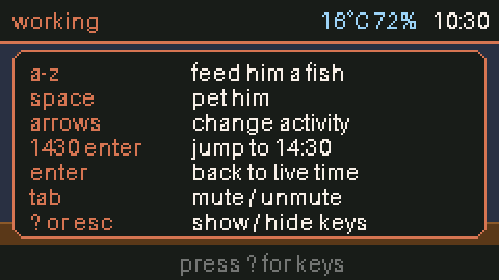 **Press `?`**: every key and command | |

These are rendered on a Mac by `tools/render_screenshots.py`, which runs the real
`device/clawd_core.py` against a stand-in for the device's graphics library. Shapes, layout and
animation frames are what the device draws. Fonts, colours and brightness are close but not exact,
and the real screen dims while he sleeps.

---

## Contents

1. [What Clawd does](#what-clawd-does)
2. [Hardware and firmware](#hardware-and-firmware)
3. [Quick start](#quick-start)
4. [Using it](#using-it)
5. [How it works](#how-it-works)
6. [Development workflow](#development-workflow)
7. [Learnings and gotchas](#learnings-and-gotchas)
8. [Ideas not yet built](#ideas-not-yet-built)
9. [Repository layout](#repository-layout)
10. [Credits](#credits)

---

## What Clawd does

### His day (UK time, fetched from the internet)

| Time | Activity | What you see |
|---|---|---|
| 23:00–07:00 | sleeping | Tucked in bed, "z"s float up, occasionally dreams of fish. Screen dims, no sounds of his own. |
| 07:00–08:30 | coffee | Holds a steaming mug, sips every few seconds, jitters after each sip. Newspaper on the table. |
| 08:30–09:30 | commute | Cycles through a scrolling city in a red helmet with a backpack ("biking to work"). |
| 09:30–10:00 | coffee | Arrival coffee. |
| 10:00–11:30 | working | Types at a monitor of scrolling code. Random events: "* thinking...", a bug (red line, "?", sweat), an idea ("!"), "tests pass!" (jumps and plays a jingle), stretches, wanders. |
| 11:30–13:00 | lunch | Eats a fish bite by bite, leaves the bones, a fresh fish appears. Glass of water. |
| 13:00–15:00 | coffee | Afternoon coffee, with a cookie on the table. |
| 15:00–17:30 | working | As above. |
| 17:30–18:30 | commute | "biking home". |
| 18:30–19:00 | workout | Headband on; cycles through dumbbells, jumping jacks and laps. |
| 19:00–20:00 | dinner | Same as lunch, by candlelight. |
| 20:00–21:30 | tv time | On the couch with popcorn; the TV flickers; he laughs now and then. |
| 21:30–22:30 | playtime | Alternates a disco dance party and acrobatics (jumps, real cartwheels). |
| 22:30–23:00 | reading | Sits up in bed with a book under a lamp, turns pages, yawns. |

The schedule is the `SCHED` table in `device/clawd_core.py` (end minute, scene).

### Side activities

Bike ride (countryside), workout, volleyball (beach, against a blue crab, with a score), cartwheels,
dancing (disco ball, plays a tune), yoga (includes a headstand) and music (bean bag, headphones,
record player, plays a tune).

- They start **on their own**: roughly one per 45 minutes awake, at least 30 minutes apart, never
  while sleeping, commuting or reading.
- Each lasts **10 minutes**; the header shows the minutes left ("volleyball 7m").
- The **arrow keys** step through them, and back to the scheduled activity.

### Weather

Clawd fetches the current weather from [Open-Meteo](https://open-meteo.com) (free, no API key) at
boot and then hourly. The location is `LAT, LON` at the top of `clawd_core.py` (London by default).

- The header shows temperature and humidity next to the clock, for example `17°C 79%`.
- The window shows clouds, rain, snow, fog or lightning; on grey days there is no sun or moon.
- Outdoor scenes (bike, commute, volleyball) get the same sky and precipitation.

### Holidays

| Holiday | Dates | Hat | Window |
|---|---|---|---|
| New Year | 31 Dec, 1 Jan | party hat | fireworks after 17:00 |
| Valentine's Day | 14 Feb | heart | hearts |
| Easter | Good Friday to Easter Monday | bunny ears | painted eggs |
| Halloween | 31 Oct | witch's hat | pumpkin |
| Bonfire Night | 5 Nov | woolly beanie | fireworks after 17:00 |
| Christmas | 24–26 Dec | Santa hat | flashing fairy lights |

He also says a short greeting now and then ("ho ho", "boo!"). Holidays follow the real date; time
travel only changes the time of day. No hat while commuting (he wears his helmet).

### Hidden needs

Clawd tracks food, energy, fun and fitness (0–100). They are not shown on screen. Each activity
changes them per minute (`F_RATE`, `E_RATE`, `J_RATE`, `S_RATE` tables). Effects:

- Food below 30: a fish thought bubble and a hungry chirp every ~25 s, a different tune each time.
- Energy below 20: a "zz" bubble. Fun below 20: a "..." bubble and a sigh.
- Saved to `/flash/clawd.dat` every 5 minutes, so they survive reboots.

### Sounds

- Replies to your keys always sound, even at night: eating (a "nom"), refusing when full (a low
  "nuh-uh"), petting (a chirp).
- His own sounds (hunger chirps, jingles, wake-up tune at 07:00, dance and music tunes) stay quiet
  while he sleeps.
- Tab mutes everything; a crossed-out speaker appears in the header.

---

## Hardware and firmware

| | |
|---|---|
| Device | M5Stack Cardputer-Adv |
| Chip | ESP32-S3FN8 (QFN56) rev 0.2, dual core 240 MHz, **8 MB flash, no PSRAM** |
| Screen | 240 × 135 IPS LCD (landscape) |
| Input | QWERTY keyboard (TCA8418 controller), Fn/Opt/Ctrl/Alt modifiers |
| Other | Speaker, WiFi, Bluetooth LE, LiPo battery, power switch on the right edge |
| USB | Native USB-Serial/JTAG (shows as `/dev/cu.usbmodem1101` on macOS), no separate driver |
| Firmware | **UIFlow 2.5.3** for Cardputer-Adv = MicroPython **1.27.0**, `.mpy` format **v6.3** |

### Firmware history

- The device shipped with **PikaScript** firmware (a Python-like interpreter with a keyboard REPL;
  the screen said "M5 v0.2", which is really the chip revision). PikaScript doesn't support
  MicroPython's file-transfer protocols, so there's no practical way to load code onto it.
- The conference expected attendees to flash **UIFlow 2** using the `m5-onboard` Claude Code skill
  in [moremas/build-with-claude](https://github.com/moremas/build-with-claude). That is how this
  device was flashed.

### Flashing a new device

Only needed once per device. Easiest: clone `moremas/build-with-claude`, then run
`python3 .claude/skills/m5-onboard/scripts/onboard.py`. It detects the board, downloads UIFlow 2
for Cardputer-Adv from M5Stack, and flashes it with esptool at 115200 baud (`--no-stub`, the only
reliable setting on native USB). Expect about 3 minutes. Or use M5Stack's **M5Burner** app.

You must put the chip into download mode by hand; there is no software way on native USB:

1. Hold **BtnG0** (small button on the back).
2. While holding it, tap **BtnRST** (also on the back).
3. Release BtnRST, keep holding BtnG0 for another second, release. The screen goes fully dark.

Then run `tools/deploy.py --clean` from this repo; it removes the conference bundle's apps if the
onboarding script installed them.

---

## Quick start

```bash
git clone https://github.com/gmtuca/tamaclawtchi && cd tamaclawtchi
pip install -r tools/requirements.txt        # pyserial, mpy-cross 1.27, esptool, pillow

cp device/clawd_secrets.example.py device/clawd_secrets.py
# edit it: list your 2.4 GHz WiFi networks as (name, password) (the file is git-ignored)

# Plug the Cardputer in with a data cable, switch it on, then:
python3 tools/deploy.py --clean              # first time; later just: python3 tools/deploy.py
```

`deploy.py` compiles `device/clawd_core.py` to `build/clawd_core.mpy` and uploads the files to
`/flash`. It then sets UIFlow's NVS `boot_option` to 2 (boot runs `/flash/main.py`) and reboots.
Clawd appears after a few seconds ("Clawd is waking up... checking the clock and weather").

`clawd_secrets.py` holds a list of networks, for example home and work:

```python
NETWORKS = [
    ("home-network-name", "home-password"),
    ("work-network-name", "work-password"),
]
```

At boot Clawd scans and joins the strongest network on the list. If an hourly check can't connect
(say you carried him from home to the office), he moves on to the next network and tries again 5
minutes later. The older one-network format (`SSID = ...`, `PASSWORD = ...`) still works.

Without `clawd_secrets.py`, Clawd still runs, but with no weather and no clock sync. If the clock
was never set, the footer says "clock not set: type an hour + enter".

---

## Using it

Press **?** on the device to see this list.

| Key | Does |
|---|---|
| any letter a–z | Feed him a fish. It drops from the sky; he catches and eats it (food +12). Up to 3 queue. If full (food ≥ 96) he bats it away. Works at night too (he wakes briefly). |
| space | Pet him: hearts, a hop, fun +6. At night he stirs ("zz?"). |
| arrows | `,` `;` `.` `/` on their own, or Fn + those keys. Right/down = next side activity, left/up = previous; the list loops through all seven and back to the schedule. |
| digits + Enter | Jump to that time: `7` = 07:00, `14` = 14:00, `1130` = 11:30. The clock turns yellow with `~`. The clock keeps running from there. Typing clears after 8 s idle. Backspace edits. |
| Enter alone | Back to live time. |
| Tab | Mute / unmute. |
| ? or Esc (Fn + top-left key) | Show / hide the key list. Any key closes it (that key does nothing else). |

There is no exit key: the device only runs Clawd. Over USB, Ctrl-C drops to the MicroPython REPL.

---

## How it works

### Boot

1. UIFlow's own `boot.py` reads NVS key `uiflow.boot_option`. With value 2 it runs `/flash/main.py`
   instead of UIFlow's launcher (which would also start Bluetooth pairing).
2. `device/main.py` calls `M5.begin()` and imports `clawd_core`, which is the precompiled
   `/flash/clawd_core.mpy`.
3. `clawd_core.run()` allocates the 240 × 97 drawing buffer **first**. Memory for it is only free
   this early; see [Learnings](#learnings-and-gotchas).
4. `sync(g)`: blocking WiFi connect (`clawd_wifi.connect`, also sets the clock via NTP), weather
   fetch, WiFi off.
5. Speaker set-up tone, then `reserve(g, True)` holds back 24 KB of memory for later WiFi trips.
6. Loads saved needs, then enters the main loop.

### Main loop (`run()`, one frame ≈ 75 ms)

```
read key → key(g, k)
tick(C, g, f):  minutes(g) → update(g, m)   # scene choice, jumps, walking, events, timers
                draw backdrop + scene into the canvas C
                fish, particles, thought bubble, key-list overlay
C.push(0, 21)                               # one SPI transfer, no flicker
hud(g, m, f)                                # header/footer drawn straight to the LCD, only when changed
sound(g)                                    # non-blocking note sequencer
stats(...) every 5 s, save(...) every 5 min, net_step(g) every frame
```

### Screen layout

- **Header**, y 0–20, drawn directly on the LCD: activity label on the left (orange); mute icon,
  temperature/humidity and clock on the right.
- **Play area**, y 21–117: the 240 × 97 canvas. Floor line at canvas y = 86.
- **Footer**, y 118–134: "press ? for keys", or what you're typing.

### The sprite

Clawd is the Claude Code logo mascot, decoded from its terminal block characters:

```
 ▐▛███▜▌        ...############...
▝▜█████▛▘   →   ...##o######o##...    o = eye
  ▘▘ ▝▝         .################.    side arms
                ...############...
                ....#.#....#.#....    four legs
```

- Each grid cell is `U` = 4 px wide and 8 px tall (terminal quadrants are twice as tall as they
  are wide), so Clawd is 72 × 40 px. Colour `0xD77757`.
- `rows(eyes, arms, legs)` builds pose variants:
  - eyes: centre, left, right, closed
  - arms: side, up, down, one raised holding a mug
  - legs: two walking frames
- `pose()` turns a pose into cached rectangles, including 90/180/270° rotations (for cartwheels and
  the yoga headstand).
- `cl()` draws Clawd. It also records his head position (the falling fish aims at it) and adds the
  holiday hat. Pass `col=` to draw another crab, as the volleyball opponent does.

### Scenes

- One scene id per activity: `SLEEP, COFFEE, WORK, EAT, GYM, TV, PLAY, READ, COMMUTE, BIKE, VOLLEY,
  CART, DANCE, YOGA, MUSIC`. Per-scene tables: `LABEL`, `HOME` (his x position), `EVENTS` (random
  events), and the four need rates.
- `FIXED` scenes keep him at `HOME` (sitting, riding); in the others he can walk, wander and hop.
- Each scene has an `sc_*` function that draws the props and Clawd and runs its own animation
  logic. Indoor scenes sit on `room()` (wall, floor, window with sky, weather and holiday
  decorations). Outdoor scenes use `outdoor()`.
- `update()` picks the scene: the side activity if one is active, otherwise
  `scene_at(minutes)`. It resets per-scene state on change.

### Time

- NTP sets the device clock to UTC. `uk_off()` adds an hour during British Summer Time (last
  Sunday of March to last Sunday of October, 01:00 UTC).
- Time travel stores an offset in `g.sim` (seconds), so the simulated clock keeps ticking.
- The device remembers the time across reboots, but not after the battery runs flat or the power
  switch is turned off.

### Network

- WiFi is off except during checks, because it holds memory.
- `net_step()` runs every frame. Once an hour it releases the memory reserve and starts a
  connection without waiting for it. On later frames it checks whether the connection is up; only
  the HTTP fetch itself (about 0.5 s) blocks. Then WiFi goes off and the reserve is claimed again.
- **Several networks** (`clawd_wifi.py`):
  - At boot, `connect()` scans, picks the known network with the strongest signal, and falls back
    through the rest of the list.
  - The hourly `begin()` doesn't scan, because scanning blocks for about 2 seconds and would freeze
    the animation. It reuses the network that worked last.
  - If joining fails within 20 s, `net_step()` moves to the next network and retries in 5 minutes.
- A failed fetch on a working connection retries after 10 minutes. The clock is re-synced daily, or
  whenever it's unset. NTP sometimes times out; that's harmless because it retries.
- Log lines name the network: `clawd: wifi connected to <name>`, `clawd: could not join <name>`.
- The weather fetch is a plain-HTTP socket request to `api.open-meteo.com`, with
  `current=temperature_2m,relative_humidity_2m,weather_code`. WMO weather codes are mapped by
  `wkind()` to clear, partly cloudy, overcast, fog, rain, snow or storm.

### Sound

- `play(g, notes, reply)` queues `(frequency, ms)` pairs; frequency 0 is a rest.
- `sound(g)` plays the next note when the previous one has finished, so the animation never blocks.
- When a tune ends it calls `M5.Speaker.stop()`. That's a safety net, because some tones never end
  on their own (see Learnings).

### Crashes

An exception in the main loop shows "Clawd crashed, restarting:" with the error for 5 s, saves the
needs and reboots. Ctrl-C over USB is not an `Exception`, so it drops to the REPL instead.

---

## Development workflow

```bash
# edit device/clawd_core.py, then:
python3 tools/deploy.py
python3 tools/run_on_device.py tools/device_test.py --fresh --reset-after     # a few minutes; expect "RESULT 0 failure(s)"
python3 tools/run_on_device.py --listen 300                                   # watch Clawd's log lines
python3 tools/render_screenshots.py                                           # see what it looks like (no device needed)
```

- **See the screen with `render_screenshots.py`.** The device can't read pixels back (no
  `readPixel` on the LCD or the canvas), and in the on-device test the canvas is usually 0 × 0, so
  draws do nothing there (see Learnings).
  - The renderer runs the real `clawd_core.py` on the Mac, with stand-ins for `M5`, `machine`,
    `network`, `hardware` and the MicroPython-only `time` functions. Drawing calls go to a Pillow
    image.
  - Each entry in `SHOTS` sets a time, weather, holiday or side activity, plus an optional hook
    (for example, pressing a key on frame 0). It runs N frames and saves the last one to
    `docs/screenshots/`.
  - Add a shot for anything you change, look at the PNG, then deploy. It already caught Clawd's
    legs poking out under the bed and the volleyball score disappearing into the sun.
  - It can't catch memory problems; only the device shows those. Ask the user to confirm on the
    real screen.
- **Wait a few seconds after a deploy before running the test.** The device is still rebooting,
  and a run started too early can exit without output.
- **Log lines** go to USB serial: `clawd: weather 16.6 79 1`, `clawd: weather failed: ...`, `clawd:
  could not reserve memory for WiFi`. Anything printed in the first second after a reboot is lost
  while USB reconnects.
- **REPL:** connect with `screen /dev/cu.usbmodem1101 115200` in a real terminal (it fails inside
  tools without a TTY) and press Ctrl-C. Only one program can hold the port. Restart Clawd with
  `import machine; machine.reset()`.
- **Importing without running:** `import builtins; builtins.clawd_test = True; import clawd_core
  as c`. This is how `device_test.py` works.
- **Faster test cycles:** to test the hourly network logic, temporarily build with
  `NET_MS = 120000` and use `--listen`.
- **Before deploying,** check for duplicate top-level names (one already caused a bug):
  `python3 -c "import ast,collections; t=ast.parse(open('device/clawd_core.py').read()); c=collections.Counter(n.id for s in t.body if isinstance(s, ast.Assign) for tg in s.targets for n in ast.walk(tg) if isinstance(n, ast.Name)); c.update(s.name for s in t.body if isinstance(s, (ast.FunctionDef, ast.ClassDef))); print([k for k,v in c.items() if v>1])"`

### Useful device APIs (UIFlow 2.5.3)

| API | Notes |
|---|---|
| `M5.Lcd.newCanvas(w, h, bpp, psram)` | Off-screen sprite. Draw on it, then `.push(x, y)` and eventually `.delete()`. |
| Canvas drawing methods | `fillRect fillCircle fillEllipse fillTriangle fillRoundRect fillArc drawLine drawCircle drawRect drawRoundRect drawTriangle drawEllipse drawArc drawString drawCenterString drawRightString drawPixel drawImage drawPng drawJpg drawBmp drawQR`, plus `setTextColor setTextSize setFont textWidth`. No `readPixel`. |
| Colours | 24-bit `0xRRGGBB` ints work. |
| Font | `M5.Lcd.FONTS.DejaVu9` |
| `M5.Lcd.setBrightness(0-255)` | Clawd uses 30 while sleeping. |
| `M5.Speaker.tone(freq, ms)` | Non-blocking; also `.stop()` and `.isPlaying()`. |
| `hardware.MatrixKeyboard()` | Call `.tick()` then `.get_key()`; returns an int or `None`. |
| `esp32.idf_heap_info(esp32.HEAP_DATA)` | System (non-MicroPython) memory: per block, (total, free, largest). |

---

## Learnings and gotchas

These cost the most time; each one is a trap for future changes.

1. **The device can't compile big Python files.** About 60 KB of MicroPython heap is free.
   Importing a 28 KB `.py` raises `MemoryError` during compilation. Compile on the Mac with
   `mpy-cross` **1.27** (format v6.3, the device's `_mpy=11014`), upload the `.mpy`, and import it
   by name. A `.py` with the same name next to the `.mpy` takes precedence, so `deploy.py` deletes
   any stray `clawd_core.py`.

2. **The drawing buffer fails silently.** `newCanvas(240, 97, 16, 0)` needs one contiguous 46 KB
   block of internal RAM (no PSRAM on this chip). Right after boot it exists. Later, for example
   when started from UIFlow's launcher, the largest free block was 7.5 KB, and `newCanvas` returned
   a **0 × 0** sprite on which every draw silently did nothing: the play area stayed black with no
   error. Always check `C.width()`. That's why Clawd allocates it first thing at boot and the
   device runs nothing else.

3. **MicroPython's heap eats WiFi's memory over time.** The heap grows into free system memory and
   never gives it back. After a while WiFi couldn't start: `connect()` returned with no error but
   the status stayed `1000` (idle) forever. Measured: 51 KB of system memory free after boot,
   14 KB after 7 minutes. Fix: `reserve()` holds a dummy 24 KB canvas between checks and releases
   it just before WiFi starts. WiFi's own net cost to connect was only about 3 KB.

4. **The speaker claims 8 KB the first time it plays,** so Clawd plays a set-up tone before
   claiming the reserve.

5. **Tones shorter than about 20 ms never stop.** `M5.Speaker.tone(100, 1)` buzzed until another
   sound replaced it (`isPlaying()` was still True 500 ms later); 20 ms and 70 ms tones end
   normally. Keep notes at 40 ms or more, and `sound()` calls `stop()` after every tune anyway.

6. **HTTPS is too heavy; plain HTTP works.** TLS needs memory the device can't spare.
   `http://api.open-meteo.com` answers over plain HTTP; use `HTTP/1.0` to avoid chunked replies.

7. **Do network work early.** NTP failed with `ENOMEM` when attempted late in a busy app. Clawd
   syncs at boot, before allocating anything else big.

8. **Module-level name clashes break things quietly.** The dance tune and the dancing scene were
   both called `DANCE`; the tune, defined later, replaced the scene id, so "dancing" drew the
   bedroom. Tests that only check labels missed it. Now the tune is `DANCE_TUNE` and the tests
   check that the dancing scene actually runs the dance routine.

9. **`builtins` attributes are only visible to bare names.** After `builtins.x = 1`, a bare `x`
   works in another module, but `getattr(builtins, "x")` raises. Hence
   `try: clawd_test / except NameError: run()` at the end of `clawd_core.py`.

10. **Interrupting a module mid-import unloads it.** Ctrl-C while `clawd_core` runs (it runs inside
    its own import) removes it from `sys.modules`, so a later `import` starts it from scratch.
    That's why runtime values are exposed through `builtins` (`clawd_buf` holds the canvas size
    at boot).

11. **Keyboard codes** (from `m5stack/libs/hardware/matrix_keyboard.py` in uiflow-micropython):

    | Key | Code |
    |---|---|
    | Tab | `0x09` |
    | Enter | `0x0D` (some builds `0x0A`; accept both) |
    | Backspace | `0x08` (Fn+Del `0x7F`) |
    | Space | `0x20` |
    | Arrows on their own | the plain characters `,` `;` `.` `/` |
    | Fn + arrows | 180 left, 181 up, 182 down, 183 right |
    | Fn + top-left key | `0x1B` Esc |
    | Shift + `/` | `?` |

    The `KEY_*` constants in `hardware.keyboard.asciimap` are **USB keyboard output codes**, not
    what `get_key()` returns.

12. **Serial quirks:**
    - The board re-enumerates on every reset, so early boot prints are lost.
    - `screen` only works in a real terminal, not through tools without a TTY.
    - Only one process can hold the port. A stray `cat` or `screen` gives "Resource busy";
      `lsof /dev/cu.usbmodem1101` finds the culprit.
    - `mpremote` does not work with PikaScript. With UIFlow, this repo uses paste mode
      (Ctrl-E … Ctrl-D) over pyserial, as in `tools/device_serial.py`.
    - Keep each pasted chunk small (384 bytes of base64 per paste); larger pastes were seen to
      truncate.

13. **UIFlow's launcher and Bluetooth.** With the default `boot_option = 1`, UIFlow starts a
    Bluetooth advertisement that breaks later Bluetooth use. `boot_option = 2` plus our own
    `main.py` avoids its launcher entirely (`deploy.py` sets it).

14. **Testing without a screen.** There is no way to read the display back. Two tools split the
    job:
    - The on-device test drives the real code (keys, scenes, events) and checks state. Run it from
      a fresh boot (`--fresh`): a REPL session that has run a while has a fragmented heap and gives
      false failures, especially for WiFi.
    - `render_screenshots.py` shows what is drawn. Use both.

15. **Frame budget.** A scene is roughly 30–100 draw calls plus one 46 KB push to the screen,
    within a 75 ms frame. Animation has looked smooth at that rate, but frame time hasn't been
    measured since the weather and holidays were added. Keep per-frame allocation low.

16. **MicroPython's `time` has no time zones.** `time.localtime()` is UTC, and `time.mktime()`
    takes an 8-field tuple in UTC. CPython uses local time and 9 fields. That's why UK summer time
    is computed by hand in `uk_off()`, and why the renderer swaps in `gmtime` and `calendar.timegm`.

---

## Ideas not yet built

Discussed with the user; none are started.

- **Focus timer:** 25 minutes of work alongside you, then a 5-minute break doing a side activity.
- **Mini-games:** steer Clawd with the arrows to catch falling fish, or play his side of volleyball.
- **Growth:** remember care over days, earn hats and outfits, get grumpy when neglected.
- **Claude Code token usage, without an API key.** Claude Code writes every session to
  `~/.claude/projects/**/*.jsonl`, and each reply records `usage` (`input_tokens`,
  `output_tokens`, `cache_read_input_tokens`, `cache_creation_input_tokens`). A Mac-side script
  could total today's tokens and either write them over the USB cable (Clawd would poll serial
  input; the port can then only be shared during deploys) or serve them on the local network for
  Clawd to fetch hourly with the WiFi logic above. It gives token counts, not plan limits. The
  user decided against it for now.
- A configurable location (instead of editing `LAT, LON`), a birthday hat.

---

## Repository layout

```
device/                       everything that runs on the Cardputer
  main.py                     /flash/main.py: boots straight into Clawd
  clawd_core.py               the whole app (compiled to clawd_core.mpy by deploy.py)
  clawd_wifi.py               WiFi: pick a known network, connect, NTP
  clawd_secrets.example.py    copy to clawd_secrets.py (git-ignored) with your WiFi networks
tools/                        runs on the Mac
  deploy.py                   compile + upload + set boot mode + reboot
  run_on_device.py            run a MicroPython script on the device with live output, or --listen
  device_test.py              the on-device test (53 checks)
  render_screenshots.py       render scenes to PNG on the Mac with the real drawing code
  device_serial.py            REPL paste-mode helpers shared by the tools
  requirements.txt
docs/screenshots/             the PNGs shown above (regenerate with render_screenshots.py)
AGENTS.md                     short orientation for coding agents
```

Files on the device after a deploy: `/flash/main.py`, `/flash/clawd_core.mpy`,
`/flash/clawd_wifi.py`, `/flash/clawd_secrets.py` and `/flash/clawd.dat` (saved needs). UIFlow's
own `boot.py`, `libs/`, `res/` and `certificate/` stay untouched.

---

## Credits

- **Clawd** is the Claude Code mascot by Anthropic. This is a fan project.
- Firmware flashing and the original Cardputer app bundle come from
  [moremas/build-with-claude](https://github.com/moremas/build-with-claude) (Apache-2.0). No code
  from it is included here.
- Weather data: [Open-Meteo](https://open-meteo.com) (free for non-commercial use).
- Keyboard codes from M5Stack's [uiflow-micropython](https://github.com/m5stack/uiflow-micropython).
